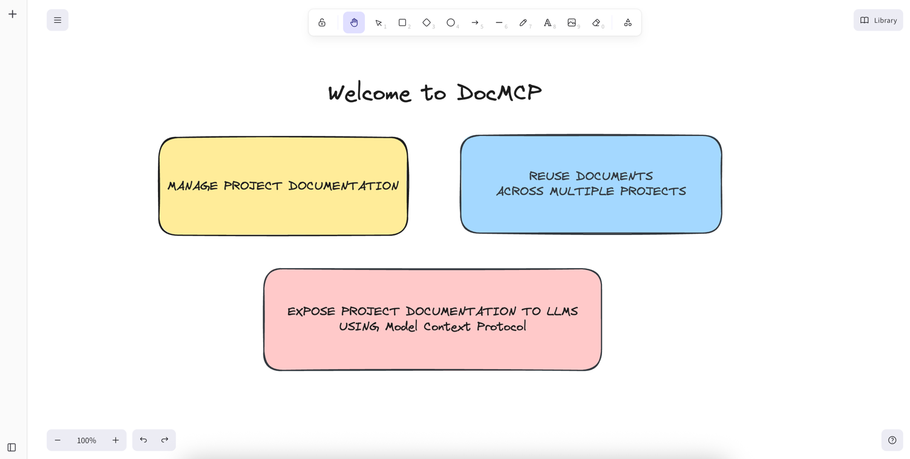
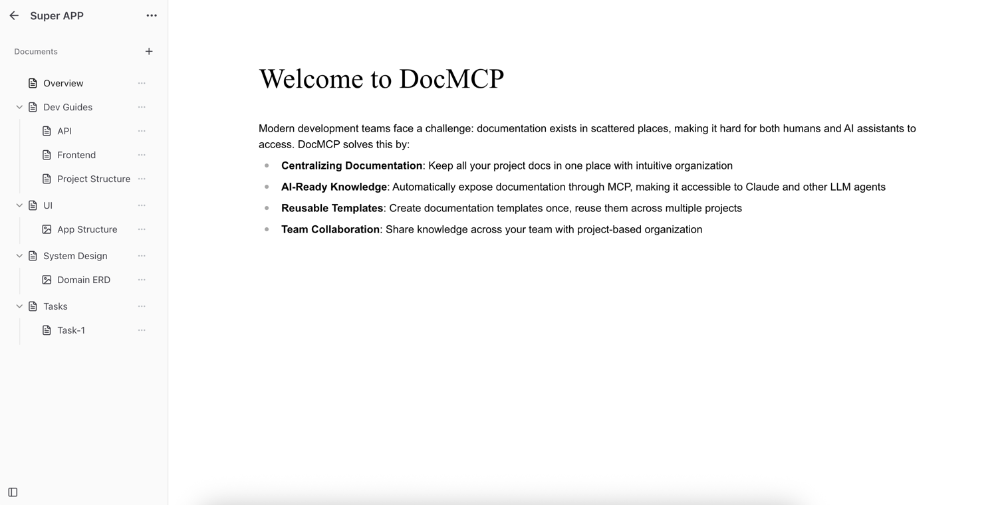
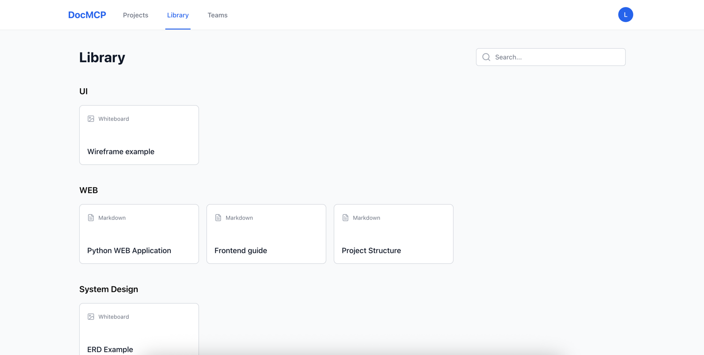
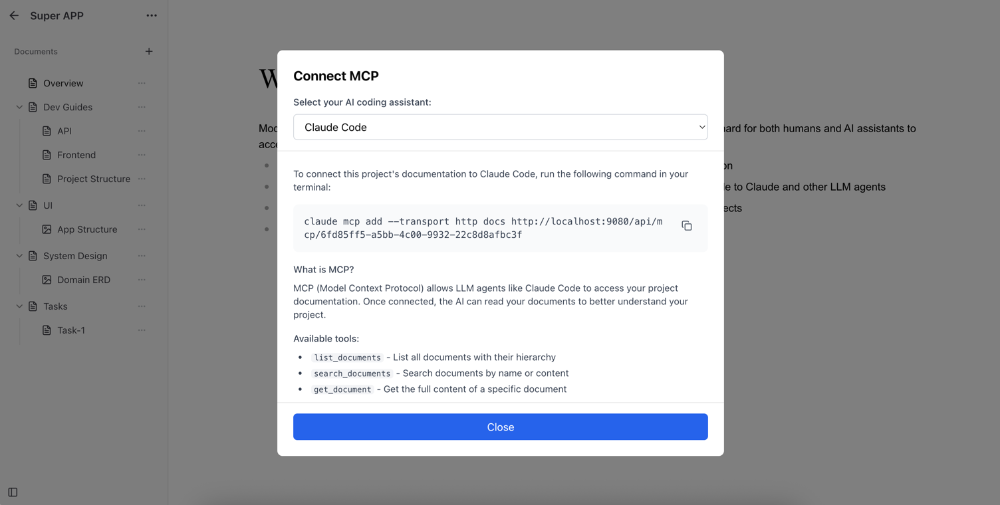

# DocMCP - Documentation as MCP



> Transform your project documentation into AI-accessible knowledge through Model Context Protocol

DocMCP is a modern web platform that bridges the gap between human documentation and AI assistants. Create, organize, and share your project documentation while making it instantly accessible to LLM agents through MCP (Model Context Protocol).


## Why DocMCP?

Modern development teams face a challenge: documentation exists in scattered places, making it hard for both humans and AI assistants to access. DocMCP solves this by:

- **Centralizing Documentation**: Keep all your project docs in one place with intuitive organization
- **AI-Ready Knowledge**: Automatically expose documentation through MCP, making it accessible to Claude and other LLM agents
- **Reusable Templates**: Create documentation templates once, reuse them across multiple projects
- **Team Collaboration**: Share knowledge across your team with project-based organization

## Quick start

Run the pre-built image from Docker Hub:

```bash
docker run -d -p 8000:8000 \
  -v docmcp_data:/app/data \
  -e APP_ENV=production \
  -e LOCAL_AUTH_ENABLED=true \
  zzzevaka/docmcp:latest
```

## Key Use Cases

### 1. Project Documentation Hub

Create comprehensive documentation for your projects with rich markdown support, organized structure, and easy navigation.



**Perfect for:**
- API documentation
- Architecture decisions
- Development guidelines
- Project onboarding materials

### 2. Template Library

Build reusable documentation templates that maintain consistency across projects. Create templates for common documentation patterns and deploy them instantly to new projects.



**Use templates for:**
- Standard README structures
- API endpoint documentation
- Testing strategies
- Deployment procedures
- Code examples
- For any documentation that you want to share across multiple projects

### 3. MCP Integration

Connect your documentation directly to AI assistants through Model Context Protocol. Your documentation becomes instantly queryable by Claude and other MCP-compatible agents.



**Benefits:**
- AI assistants can access your project-specific knowledge
- Provide context-aware responses based on your documentation
- Keep AI responses aligned with your team's standards
- Reduce repetitive explanations of project-specific concepts

## Features

- **Rich Markdown Editor**: Write documentation with full markdown support including code blocks, tables, and more
- **Whiteboard Support**: Visual collaboration with diagrams, flowcharts, and sketches embedded in your documentation
- **Project Organization**: Organize docs by projects with hierarchical structure
- **Template System**: Create and reuse documentation templates across projects
- **MCP Integration**: Automatic exposure of documentation through Model Context Protocol
- **Team Collaboration**: Share projects and docs with your team
- **Version Control**: Track changes to your documentation over time
- **Search & Discovery**: Quickly find the documentation you need
- **Flexible Authentication**: Local email/password registration or optional Google OAuth

## Deployment

### Local dev environment

Start the development environment:

```bash
docker-compose up -d
```

Access at:
- **Frontend**: http://localhost:5173
- **Backend API**: http://localhost:8000

### Single container

```bash
docker build -t docmcp:latest .
docker run --rm -p 8001:8000 \
  -v docmcp_data:/app/data \
  -e APP_ENV=production \
  -e LOCAL_AUTH_ENABLED=true \
  docmcp:latest
```

### Authentication
- Local authentication:
  - `LOCAL_AUTH_ENABLED=true`
- Google OAuth2:
  - `GOOGLE_CLIENT_ID=<client>`
  - `GOOGLE_CLIENT_SECRET=<secret>`

## Roadmap

- [ ] Real-time collaboration on documents
- [ ] Document version comparison
- [ ] Custom MCP tool definitions
- [ ] API documentation auto-generation
- [ ] Integration with popular dev tools (GitHub, GitLab, Jira)
- [ ] Advanced permissions and access control
- [ ] Document analytics and insights

## Contributing

Contributions are welcome! Please feel free to submit issues and pull requests.

For development setup and guidelines, see the [Development Guide](docs/dev/DEVELOPMENT.md).

## License

TBD
